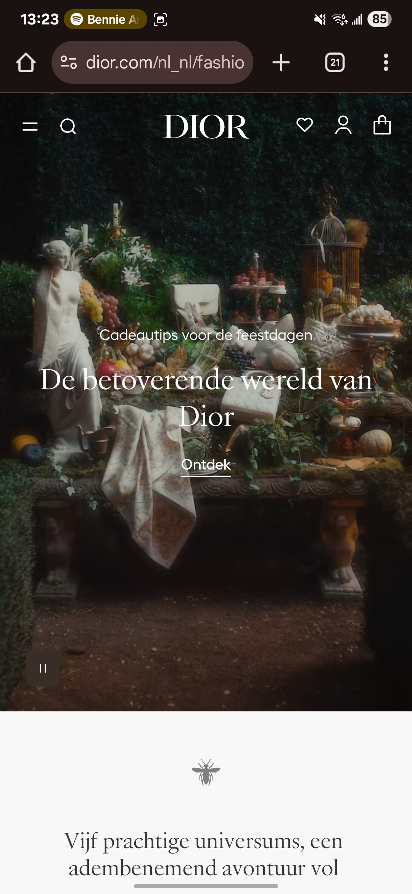
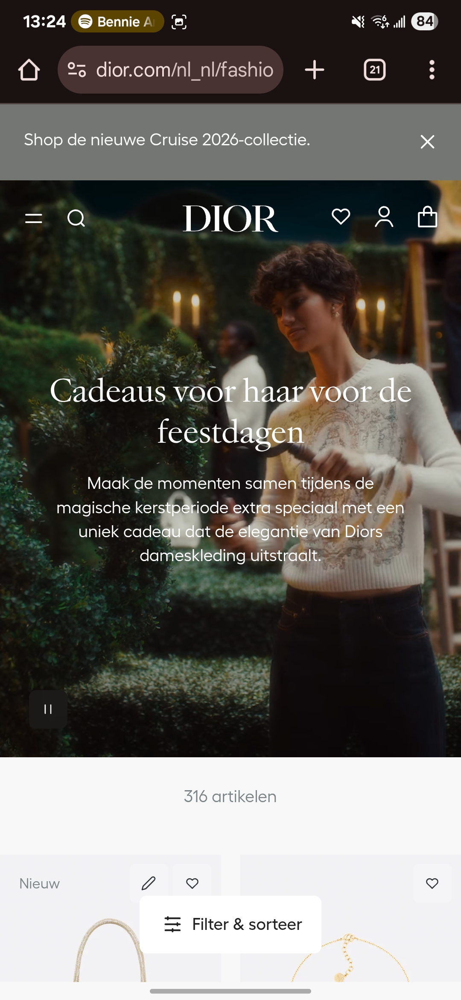
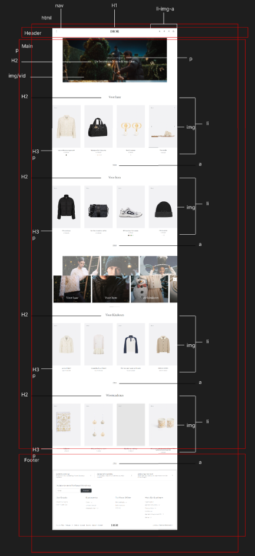

# Procesverslag
Markdown is een simpele manier om HTML te schrijven.  
Markdown cheat cheet: [Hulp bij het schrijven van Markdown](https://github.com/adam-p/markdown-here/wiki/Markdown-Cheatsheet).

Nb. De standaardstructuur en de spartaanse opmaak van de README.md zijn helemaal prima. Het gaat om de inhoud van je procesverslag. Besteedt de tijd voor pracht en praal aan je website.

Nb. Door *open* toe te voegen aan een *details* element kun je deze standaard open zetten. Fijn om dat steeds voor de relevante stuk(ken) te doen.

## Jij

  
uitwerken voor kick-off werkgroep

  ### Auteur:
  Emilie Garcia Van Dongen

  #### Je startniveau:
  Blauw

  #### Je focus:
  Surface plane
 

## Je website

  
uitwerken voor kick-off werkgroep

  ### Je opdracht:
https://www.dior.com/nl_nl/fashion

  #### Screenshot(s) van de eerste pagina (small screen): 
  home pagina
  

  #### Screenshot(s) van de tweede pagina (small screen):
  product pagina
  
 

## Toegankelijkheidstest 1/2 (week 1)

  
uitwerken na test in 2e werkgroep

  ### Bevindingen
1. remove horizontal scrolling
2. Alle fotos hebben een alt element nodig
3. media niet laten autoplayen
4. geen dark mode

## Breakdownschets (week 1)

  
uitwerken na afloop 3e werkgroep

  ### de hele pagina: 
  
  

  ### dynamisch deel (bijv menu): 

  ### wellicht nog een dynamisch deel (bijv filter): 
  

## Voortgang 1 (week 2)

  
uitwerken voor 1e voortgang

  ### Stand van zaken
  hier dit ging goed & dit was lastig (neem ook screenshots op van delen van je website en code)

  ### Agenda voor meeting
  samen met je groepje opstellen

Emilie: 
 1.  tot hoever moet de website in de detailles uitgewerkt worden?
2. waarom speelt de video niet af en hoe kan ik zorgen dat ie niet automatisch gaat afspelen?
3. Hoe zet ik de fonts erin nadat ik ze gedownload heb?

Roos:
1. Hoe kan ik in mijn menu nog een menu maken?
2. Wat valt er onder de header?

  ### Verslag van meeting
  hier na afloop snel de uitkomsten van de meeting vastleggen

  - icon svg
  - ...

## Voortgang 2 (week 3)

  
uitwerken voor 2e voortgang

  ### Stand van zaken
  hier dit ging goed & dit was lastig (neem ook screenshots op van delen van je website en code)

  ### Agenda voor meeting
  samen met je groepje opstellen

Roos:
hoe krijg ik een gradiant op mijn foto?
hoe spreek ik meerdere types aan zonder dit 2x het zelfde erin te moeten zetten met nth-of-type()
hoe krijg ik die pijltjes gestyld in de details/summary

Lois:
1.Als er een timer midden in de tekst staat, moet dit dan toegevoegd worden in html en zo ja hoe voeg je dit toe?
2. Kan je ook meerdere sections in een section hebben of dien je dan articles te gebruiken?
 

Emilie:
hoe krijg ik de puntjes bij mijn lijst weg? (hoe het normaal gedaan wordt werkt niet)
Ik hen een div is dit div waardig?
Hoe zet ik de svg er goed in?
Hoe krijgt ik mijn sections goed onder elkaar?

Eva:
hoe pas ik flexbox (of een grid) toe op een description list zonder divs te gebruiken?
- is het legaal om een font van onlinewebfonts.com te downloaden en toe te voegen met @fontface?
- kan ik beter een grid of flexbox gebruiken voor de layout van mijn sections?
- wat is de beste tag voor een label?

  ### Verslag van meeting
  hier na afloop snel de uitkomsten van de meeting vastleggen

  - punt 1
  - punt 2
  - nog een punt
- ...

## Toegankelijkheidstest 2/2 (week 4)

  
uitwerken na test in 9e werkgroep

  ### Bevindingen
  Lijst met je bevindingen die in de test naar voren kwamen (geef ook aan wat er verbeterd is):

## Voortgang 3 (week 4)

  
uitwerken voor 3e voortgang

  ### Stand van zaken
  hier dit ging goed & dit was lastig (neem ook screenshots op van delen van je website en code)

  ### Agenda voor meeting
  samen met je groepje opstellen

 Roos:
Waarom tabt ie ook de linkjes in het gesloten menu?
Hoezo zit hier witruimte en hoe krijg ik die weg?
Valt het hamburgermenu en automatische carousel onder de 5 elementen van surface plane?

 Lois:
1. hoe ik mijn nav elementen over mijn header img krijg, of dat ik het op dezelfde grid lijn dien te zetten of dit met position absolute kan fixen? (want position absolute werkt nog niet)
2. hoe bewerk ik verschillende svg's in de nav apart van elkaar? nth of type lukt even niet

 Emilie:
1. Ook een witruimte die ik niet weg krijg
2. Achtergrond kleur bij de nav icoon krijg ik niet weg
3. Hoe krijg ik het middelste svg met meer ruimste tussen de andere nav elementen?

 Eva:
Wat is de beste plek voor mijn custom properties?
Heb ik de <table> correct gemaakt?
hoe hou ik een grid item vierkant op hele smalle schermen?

  ### Verslag van meeting
  hier na afloop snel de uitkomsten van de meeting vastleggen

  - punt 1
  - punt 2
  - nog een punt
  - ...

## Eindgesprek (week 5)

  
uitwerken voor eindgesprek

  ### Je uitkomst - karakteristiek screenshots:
  

  ### Dit ging goed/Heb ik geleerd: 
  Korte omschrijving met plaatjes

  

  ### Dit was lastig/Is niet gelukt:
  Korte omschrijving met plaatjes

  

## Bronnenlijst

  
continu bijhouden terwijl je werkt

  Nb. Wees specifiek ('css-tricks' als bron is bijv. niet specifiek genoeg). 
  Nb. ChatGpT en andere AI horen er ook bij.
  Nb. Vermeld de bronnen ook in je code.

  1. bron 1
  2. bron 2
  3. ...

